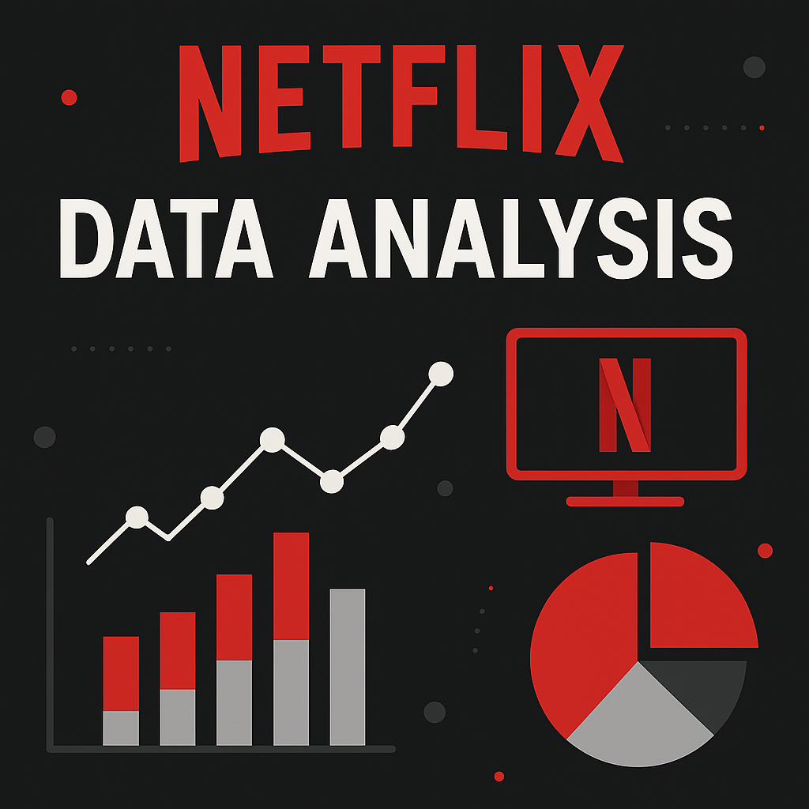

# 🎬 Netflix Data Analysis

<p align="center">
  
</p>

# 🎬 Netflix Data Analysis Project

Explore the trends and insights behind Netflix’s vast content library using data visualization and analytics. This project reveals how Netflix’s offerings have evolved over time, what genres dominate, and which countries contribute the most to its global catalog.

## 📌 Project Overview

This data-driven project analyzes Netflix’s content catalog to uncover meaningful trends and patterns in both movies and TV shows. The analysis provides valuable insights into content distribution, genre preferences, and temporal trends across the platform.

### 🔍 Project Goals
- Understand the growth of Netflix content over the years.
- Identify top-performing genres and content types.
- Analyze content distribution by countries.
- Explore release patterns and content ratings.

## 📊 Dataset Information

The dataset used is the **Netflix Movies and TV Shows Dataset**, which includes comprehensive details about Netflix’s content as of the latest update.

### 🔑 Key Columns:
- **`type`** – Indicates whether the content is a *Movie* or *TV Show*.
- **`title`** – Name of the content.
- **`country`** – Country of origin.
- **`release_year`** – Year the content was released.
- **`listed_in`** – Genre(s) or categories of the content.
- **`duration`** – Duration (minutes or seasons).
- **`rating`** – Content rating (e.g., *TV-MA*, *PG*, *R*).

## 📈 Key Insights

✅ **Movies** make up the majority of Netflix's catalog.  
🌍 The **United States** contributes the most content, followed by **India** and the **United Kingdom**.  
📅 A noticeable spike in content releases occurred during **2019–2020**.  
🎭 Top genres include **Dramas**, **International Movies**, and **Comedies**.

## 🛠️ Tools & Libraries Used

- **Python 3** – Programming language  
- **Jupyter Notebook** – Development environment  
- **pandas** – For data cleaning and manipulation  
- **numpy** – For numerical operations  
- **matplotlib** & **seaborn** – For creating rich data visualizations  

## 🚀 How to Run This Project

1️⃣ **Clone the repository** or **download the notebook**:
- File: `Netflix-Data-Analysis.ipynb`

2️⃣ **Install the required libraries**:
```bash
pip install pandas numpy matplotlib seaborn
